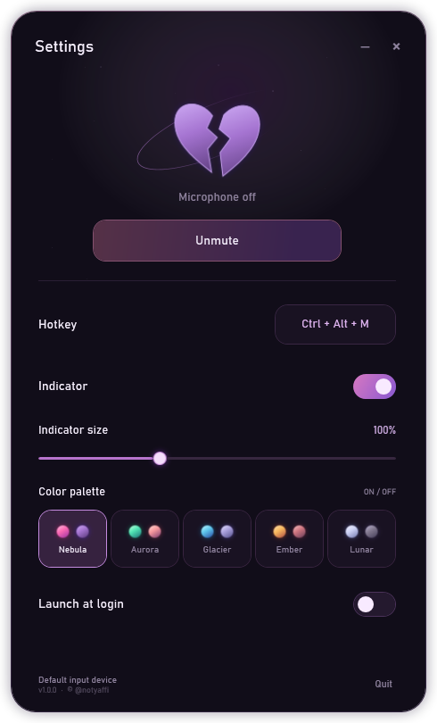
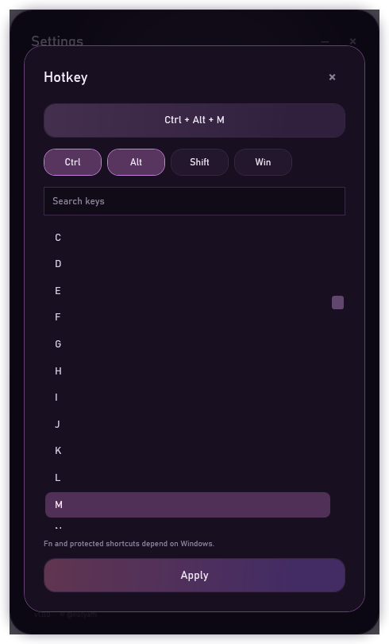

## Mic Control
A tiny Windows mic toggle with a soft heart glow

**v1.0.0** · Windows 10/11 · Portable

Press **Ctrl + Alt + M** to mute or unmute the default microphone. Mic Control stays in the tray, can start with Windows, and gives you a little heart in the top-left so you always know the current state.

  
  

  

### Little features

- Smooth heart pulse when the mic is on, broken heart when it is muted.
- Five glow palettes: Nebula, Aurora, Glacier, Ember, and Lunar.
- Indicator size from 50% to 200%.
- Custom hotkeys, tray controls, and optional launch at login.

### Run

Open `MicControl.exe` and you are good to go. Settings are available from the tray icon.
